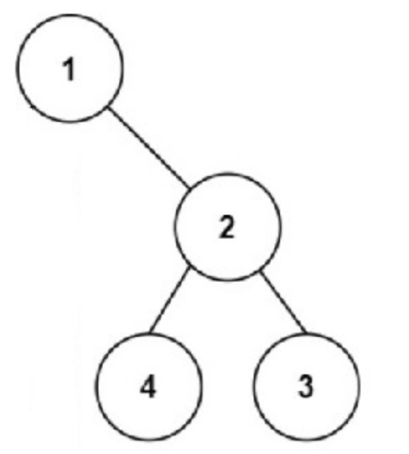

# Marda Twins Challenge

## Problem Statement

Once upon a time in the kingdom of CodeLand, there were two ancient trees known as Tree A and Tree B. These trees were said to possess magical properties much like the twins Arya and Vansh, the wise programmers of CodeLand, who often sought to explore their mysteries.

They proposed an open problem that if anyone could prove the two trees, A and B, were identical, a hidden treasure of programming wisdom would be revealed. They called this, "Marda Twins Challenge."

One day, a talented programmer like you arrived in CodeLand, eager to take on this challenge.
The challenge was simple: Write a function to determine whether Tree A and Tree B were identical. **Two trees were considered identical if they had the same structure and the same values at each corresponding node.**

Here is the formal problem statement:

## Formal Statement

You are given two arrays representing nodes of two binary trees, respectively. You are also provided with a function that converts the array into binary tree and returns the tree's root. Your task is to pass the arrays along with their sizes individually through the provided function.

The input would thus effectively be modified to two arguments, Nodeptr A and Nodeptr B.
Then, you must write a code that takes these 2 tree's root as input and prints **"YES"** if the trees are identical and **"NO"** otherwise.

## Input Format

The first line contains an integer an ***N*** representing the size of the array.

The next 2 lines contains ***N*** space separated integers:

arr1[i] and arr2[i] for 0<=i<=N-1,  representing the nodes of respective trees.

**Note:** The tree is constructed such that node *i* has the left node at *2i+1* and right node at *2i+2* (following 0-based indexing). **If there is no node then its value would be -1.**

**EXAMPLE**
`arr = [1 -1 2 -1 -1 4 3]`


**Function is given that converts the array into tree and returns the pointer to the root of the tree:**

* Node is a structure representing a node in the binary tree.
* Each node has an integer value, and a left and right child pointer.

```
#include<stdio.h>
#include<stdlib.h>
#include<assert.h>
#include <stdbool.h>

typedef struct Node Node;
typedef struct Node* Nodeptr;
struct Node{
    int val;
    Nodeptr right;
    Nodeptr left;
};

Nodeptr init(int x){
    Nodeptr head = (Nodeptr)malloc(sizeof(Node));
    head->right = NULL;
    head->left = NULL;
    head->val = x;
    return head;
}

Nodeptr createTree(int* arr, int n){
    
    Nodeptr v[n];
    for(int i=0;i<n;i++){
        if(arr[i] != -1){
            v[i] = init(arr[i]);
        }
    }

    int idx = 0;
    
    while(idx<n){
        if(arr[idx] == -1){
            idx+=1;
            continue;
        }
        if(2*idx+1<n && arr[2*idx+1]!=-1){
            v[idx]->left = v[2*idx+1];
        }
        if(2*idx+2<n && arr[2*idx+2]!=-1){
            v[idx]->right = v[2*idx+2];
        }
        idx+=1;
    }
    return v[0];
}
```

## Output Format

* Print **"YES"** if binary trees are identical
* Otherwise print **"NO"**

**NOTE:** The output is case sensitive.

## Constraints

* The size of the array, N: **1<=N<=1e5**
* The value of each element in the array is an integer in the range **[-1, 1e7].**


**NOTE:** The input arrays for trees should only be used to construct binary trees. If used anywhere else, there will be severe penalty.

## Sample Test Cases:

### Input:

```
7
1 -1 2 -1 -1 4 3
1 -1 2 -1 -1 4 3
```

### Output:

```
YES
```

### Explanation:

The tree as visualised above are identical.

### Input:

```
6
1 2 3 4 -1 5
1 2 3 4 -1 5
```

### Output:

```
YES
```

### Input:

```
7 
1 2 3 4 -1 5 -1
1 2 3 4 -1 5 -1
```

### Output:

```
YES
```

### Input:

```
7 
1 2 3 4 -1 5 -1
1 2 3 4 -1 2 -1
```

### Output:
```
NO
```